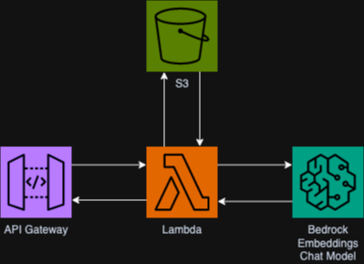
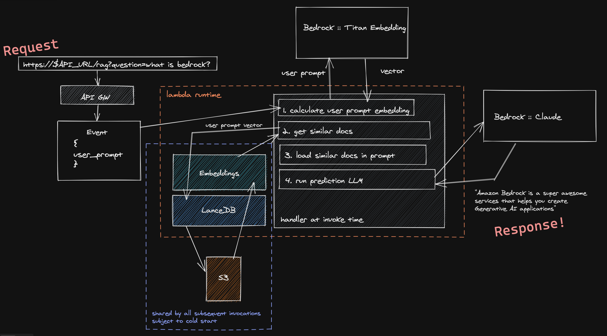

# Serverless Retrieval Augmented Generation (RAG) with Amazon Bedrock, Lambda, and S3

This pattern demonstates an implementation of Retrieval Augmented Generation, making usage of Bedrock, Lambda, and LanceDB embedding store backed by S3.

Learn more about this pattern at Serverless Land Patterns [here](https://github.com/aws-samples/serverless-patterns/tree/main/apigw-lambda-bedrock-s3-rag)

Important: this application uses various AWS services and there are costs associated with these services after the Free Tier usage - please see the [AWS Pricing page](https://aws.amazon.com/pricing/) for details. You are responsible for any AWS costs incurred. No warranty is implied in this example.

## Requirements

* [Create an AWS account](https://portal.aws.amazon.com/gp/aws/developer/registration/index.html) if you do not already have one and log in. The IAM user that you use must have sufficient permissions to make necessary AWS service calls and manage AWS resources.
* [AWS CLI](https://docs.aws.amazon.com/cli/latest/userguide/install-cliv2.html) installed and configured
* [Git Installed](https://git-scm.com/book/en/v2/Getting-Started-Installing-Git)
* [AWS Serverless Application Model](https://docs.aws.amazon.com/serverless-application-model/latest/developerguide/serverless-sam-cli-install.html) (AWS SAM) installed

## Deployment Instructions

1. Create a new directory, navigate to that directory in a terminal and clone the GitHub repository:
    ``` 
    git clone https://github.com/giusedroid/serverless-rag-python.git
    ```
1. Change directory to the pattern directory:
    ```
    cd serverless-rag-python
    ```
1. From the command line, use AWS SAM to deploy the AWS resources for the pattern as specified in the template.yml file:
    ```
    sam build
    sam deploy --guided
    ```
1. During the prompts:
    * Enter a stack name
    * Enter the desired AWS Region
    * Allow SAM CLI to create IAM roles with the required permissions.

    Once you have run `sam deploy --guided` mode once and saved arguments to a configuration file (samconfig.toml), you can use `sam deploy` in future to use these defaults.

1. Note your stack name and outputs from the SAM deployment process. These contain the resource names and/or ARNs which are used for testing.

## How it works


With this pattern we want to showcase how to implement a serverless Retrieval Augmented Generation (RAG) architecture.  
Customers asked for a way to quickly test RAG capabilities on a small number of documents without managing infrastructure for contextual knowledge and non-parametric memory.  
In this pattern, we run a RAG workflow in a single Lambda function, so that customers only pay for the infrastructure they use, when they use it.  
We use [LanceDB](https://lancedb.com/) with Amazon S3 as backend for embedding storage.  
This pattern deploys one Lambda function behind an API Gateway and an S3 Bucket where to store your embeddings.  
This pattern makes use of Bedrock to calculate embeddings with Amazon Titan Embedding and Claude as prediction LLM.  
We also provide a local pipeline to ingest your PDFs and upload them to S3.



## Ingest Documents
Once your stack has been deployed, you can ingest PDF documents by following the instructions in [`./data-pipeline/README.md`](./data-pipeline/README.md)

## Testing

```bash
./test.sh <your-stack-name> # find it in ./samconfig.toml
```

### Sample Output
```bash
Starting warmup at 2023-11-01 16:20:38.662
Warmup ended at 2023-11-01 16:20:41.156
Time to Lambda timeout: 28999 ms

Testing prediction endpoint at 2023-11-01 16:20:41.183
Prediction ended at 2023-11-01 16:20:59.934

{"message": " Based on the provided context, the relevant information about Amazon Bedrock pricing is:\n\nWith Amazon Bedrock, you pay to run inference on any of the third-party foundation models. Pricing is based on the volume of input tokens and output tokens, and on whether you have purchased provisioned throughput for the model. For more inform tion, see the Model providers page in the Amazon Bedrock console. For each model, pricing is listed following the model version. For more information about purchasing provisioned throughput, see Provisioned throughput (p. 55).\n\nFor more information, see Amazon Bedrock Pricing.\n\nSo in summary, the Amazon Bedrock pricing model is based on the number of tokens processed during inference and whether provisioned throughput is purchased. The pricing details for each model are listed in the console."}
```

## Known Limitations
This implementation is subject to the hard limit on the timeout of APIGateway set to 29 seconds. We have measured the probability of failure because of `endpoint timeout` errors to be around 5% (n=700 observations). 

## Cleanup
 
1. Delete the stack
    ```bash
    sam delete
    ```

## Authors
### Giuseppe Battista
Giuseppe Battista is a Senior Solutions Architect at Amazon Web Services. He leads soultions architecture for Early Stage Startups in UK and Ireland. He hosts the Twitch Show \"Let's Build a Startup\" on twitch.tv/aws and he's head of Unicorn's Den accelerator.  

[LinkedIn](https://www.linkedin.com/in/giusedroid/)
[GitHub](https://github.com/giusedroid)
[Buy me a Pint](https://monzo.me/giusebattista?amount=7)

### Kevin Shaffer-Morrison
Kevin Shaffer-Morrison is a Senior Solutions Architect at Amazon Web Services. He's helped hundreds of startups get off the ground quickly and up into the cloud. Kevin focuses on helping the earliest stage of founders with code samples and  twitch live streams  on twitch.tv/aws.  

[Linkedin](https://www.linkedin.com/in/kshaffermorrison)
[GitHub](https://github.com/shafkevi)

----

SPDX-License-Identifier: MIT-0
